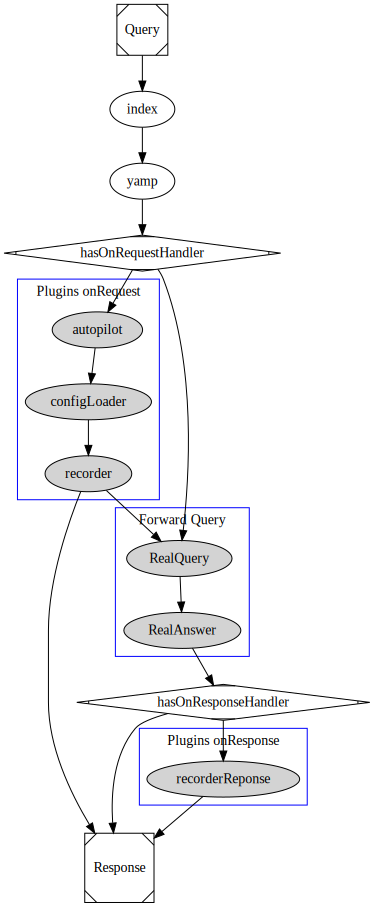

# CICP (Continuous Integration Companion Proxy)

During one of my jobs we needed to be able to do integration test against external website.  
To be able to do so, we, first did not wanted to hit the website for real everytime, and second, we wished to have a stable set of answer to have a predictible result.

This software has been build to act as a proxy to register all queries & answers and being able to replay them at a later use.  
The challenge came with the time that we should offset and also we wanted to speed up test and so shorten the time between each answers.

Moreover, on some website, there are some protection like CSRF that we need to bypass easily without to much overhead.

# How to use it

## From commandline (npm package or docker)

```bash
npm i -g cicp
cicp parameters
```

or by using docker

```bash
docker run -it @dblk/cicp parameters
```

You can have all parameters with cicp `--help`

## Comandline options

```sh
_______________________________ 
__  ____/___  _/_  ____/__  __ \
_  /     __  / _  /    __  /_/ /
/ /___  __/ /  / /___  _  ____/ 
\____/  /___/  \____/  /_/      
                                
Usage: cicp [options]

CICP providing record/replay & autopilot mode

Options:
  -V, --version          output the version number
  -p, --port <port>      The port to listen to
  -l, --listen           Begin to listen when launching
  -s, --silent           Disable all logs
  --no-color             Disable color in output message
  -f, --folder <folder>  The folder where to save session
  -o, --order <list>     A comma separated list on which order plugins should be proceded (default: "autopilot,configLoader,recorder")
  -h, --help             output usage information
```

## Generate certificate

## How it works




## Test

For HTTP:
```sh
curl -Lv --proxy http://localhost:8080 --proxy-insecure http://google.com
```

or

For HTTPS:
```sh
curl -Lv --proxy http://localhost:8081 --proxy-insecure https://google.com
```

# Features

To provide an easy use, this software has a tiny core (this project) and provide the rest of the features as plugins.  
This way, you can easily remove or add YOUR own plugins inside the basic workflow.  

All core plugins are under `@dblk` namespace on npm registry.

To know how to build a plugin for cicp, simply go to the [cicp-plugin-scaffold](http://github.com/dblk/cicp-plugin-scaffold) repository.

# Plugins

Here is a currated list of available plugins. (Please make a PR to add yours):

* `@dblk/autopilot`: Handle all command received as headers for CICP
* `@dblk/configLoader`: Handle read/write of recordset for CICP
* `@dblk/recorder`: Add a record/replay capabilities for CICP

More to come...

# Additional Informations

If you simply want to launch the proxy with the default values, simply run `cicp -l` ;).

This module use `DEBUG` so feel free to add `DEBUG=cicp:main` to see debug logs.

# Roadmap

- Add more core plugins to extend cicp.

# License

```
Copyright (c) 2019 Rémy Boulanouar

Permission is hereby granted, free of charge, to any person obtaining a copy
of this software and associated documentation files (the "Software"), to deal
in the Software without restriction, including without limitation the rights
to use, copy, modify, merge, publish, distribute, sublicense, and/or sell
copies of the Software, and to permit persons to whom the Software is
furnished to do so, subject to the following conditions:


The above copyright notice and this permission notice shall be included in
all copies or substantial portions of the Software.


THE SOFTWARE IS PROVIDED "AS IS", WITHOUT WARRANTY OF ANY KIND, EXPRESS OR
IMPLIED, INCLUDING BUT NOT LIMITED TO THE WARRANTIES OF MERCHANTABILITY,
FITNESS FOR A PARTICULAR PURPOSE AND NONINFRINGEMENT.  IN NO EVENT SHALL THE
AUTHORS OR COPYRIGHT HOLDERS BE LIABLE FOR ANY CLAIM, DAMAGES OR OTHER
LIABILITY, WHETHER IN AN ACTION OF CONTRACT, TORT OR OTHERWISE, ARISING FROM,
OUT OF OR IN CONNECTION WITH THE SOFTWARE OR THE USE OR OTHER DEALINGS IN
THE SOFTWARE.
```
